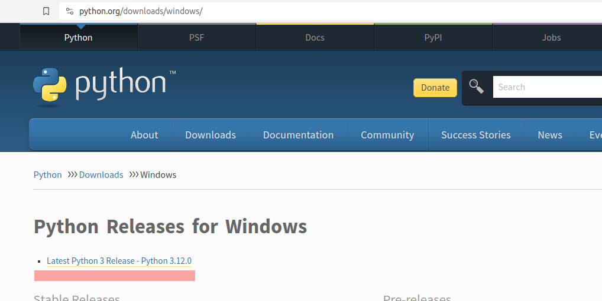
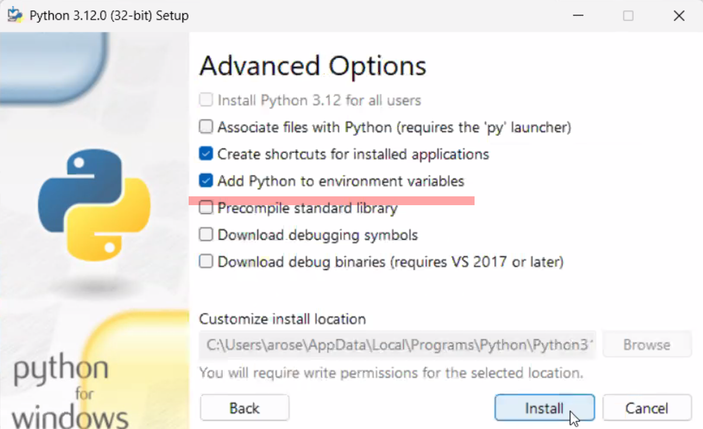
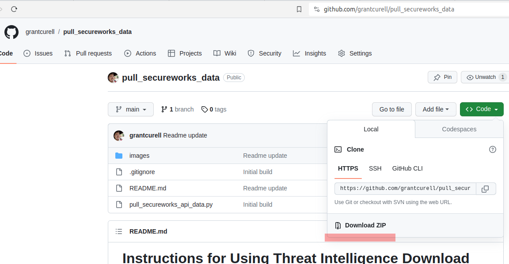
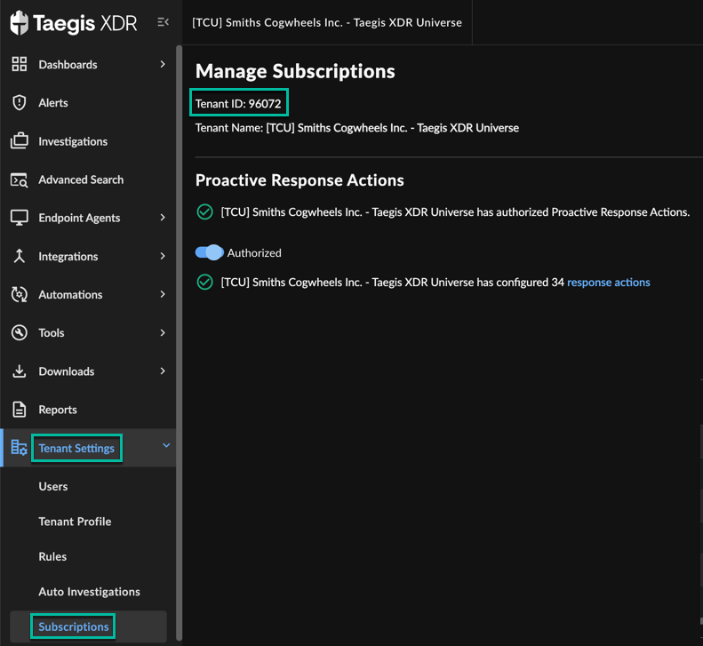
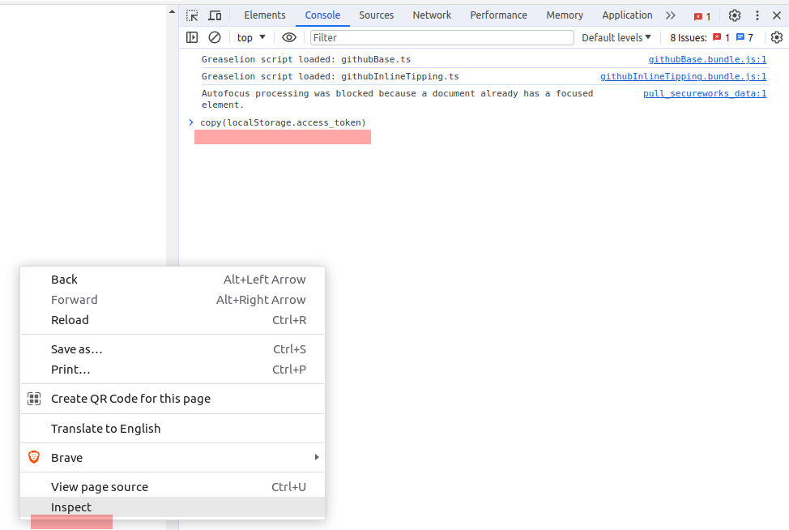

# Instructions for Using Threat Intelligence Download Script

- [Instructions for Using Threat Intelligence Download Script](#instructions-for-using-threat-intelligence-download-script)
  - [Prerequisites](#prerequisites)
    - [Installing Python on Windows](#installing-python-on-windows)
  - [Downloading the Script](#downloading-the-script)
  - [Getting SecureWorks Credentials](#getting-secureworks-credentials)
    - [Find Tenant ID on Subscriptions Page](#find-tenant-id-on-subscriptions-page)
    - [Getting Access Token](#getting-access-token)
      - [Step 1](#step-1)
      - [Step 2](#step-2)
      - [Step 3](#step-3)
  - [Editing the Script](#editing-the-script)
  - [Running the Script](#running-the-script)
  - [What the Script Does](#what-the-script-does)


This document provides a step-by-step guide on how to set up and run the pull_secureworks_api_data.py script to download threat intelligence data.

## Prerequisites

Before you begin, ensure you have Python installed on your system.

### Installing Python on Windows

1. Visit the official Python website at [python.org](https://www.python.org/downloads/windows/).



2. Click on 'Downloads' and select the Windows version.
3. Download the executable installer.
4. Run the downloaded file and follow the installation prompts. Make sure to check the box that says **You must select the option that says Add Python to environment variables or it will not work.**



## Downloading the Script

1. Go to the GitHub repository at https://github.com/grantcurell/pull_secureworks_data.
2. Find the green button labeled 'Code' and click on it.
3. Click 'Download ZIP'.
4. Once downloaded, extract the ZIP file to your desired location.



## Getting SecureWorks Credentials

To create your client credentials manually, follow the steps below:

### Find Tenant ID on Subscriptions Page

To find your tenant ID, select **Tenant Settings** from the left-hand side navigation of XDR and choose **Subscriptions**.



### Getting Access Token

While you are on SecureWorks' website do the following:

#### Step 1
Log in to Taegis™ XDR in Chrome.

#### Step 2
Open the Chrome Developer Tools by right clicking on a web page and selecting inspect.

#### Step 3

Go to the Console tab and enter the following:

```javascript
copy(localStorage.access_token)
```

It should look like this:



You have to type the command in and hit enter. **THE COMMAND WILL RETURN undefined**. That's ok, it puts your access token on the clipboard.

**IT WILL ONLY WORK IF YOUR ACTIVE TAB IS THE SECUREWORKS WEBSITE**

At this point you have your access token in the copy clipboard. You now need to place your tenant ID and access token in the script.

**WARNING** The access token will only be valid as long as your session lasts with the SecureWorks website and then it will die.

With the access token copied, move on to the next step.

## Editing the Script

1. Navigate to the extracted folder and locate the [`pull_secureworks_api_data.py`](./pull_secureworks_api_data.py) file.
2. Open the file and choose to open with your native text editor (such as Notepad).

Before running the script, update it with your `ACCESS_TOKEN` and `TENANT_ID`.

Within the text editor, locate the following lines:

```python
ACCESS_TOKEN = 'YOUR_ACCESS_TOKEN'
TENANT_ID = 'YOUR_TENANT_ID'
```

Replace them with your ACCESS_TOKEN and TENANT_ID. The access token again is a really long list of jibberish and the tenant ID should be 6 numerical digits.

## Running the Script

After setting up your credentials, follow these steps to execute the script:

1. Open Command Prompt by typing `cmd` in the Windows search bar and hitting Enter.
2. Run `pip install requests`
3. Navigate to the directory where the script `pull_secureworks_api_data.py` is located using the `cd` command. For example, if your script is in the Downloads folder, type `cd Downloads` and press Enter.
4. Execute the script by typing `python pull_secureworks_api_data.py` and press Enter.

The script will start running, and you will see the output in the Command Prompt window indicating the progress of the download. Once completed, check the designated output folder for the threat intelligence data.

## What the Script Does

When the script runs, it will:
- Connect to the SecureWorks service using the access token and tenant ID you provided.
- Download all available SecureWorks data into the folder downloads in the current directory

Don't forget you have to replace `YOUR_ACCESS_TOKEN` and `YOUR_TENANT_ID` with valid credentials and save the changes to the script before running it.
